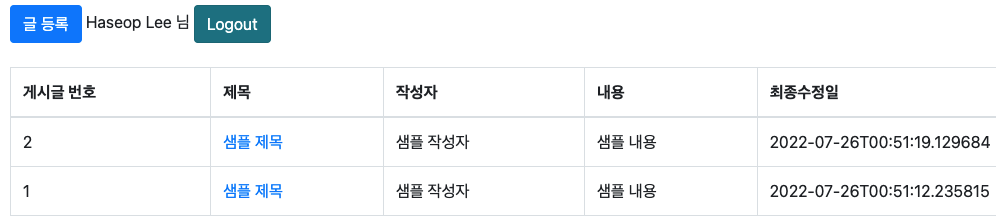

# 스프링부트와 AWS 혼자 구현하는 웹서버

교재를 참고하여 최신 소스로 프로젝트를 재설정 합니다.

## 환경

- Jdk: open jdk 17
- DB: H2 Database
- Tool: IntelliJ
- Spring Boot Version: ~~2.7.1~~ 2.6.9

인텔리J 기본 설정은 다음과 같이 [설정](https://haservi.github.io/posts/spring/spring-intellij-start-setting/) 해주면 됩니다.

### OAuth2 관련

`application-oauth.yml`파일을 생성하여 [구글 콘솔](https://console.cloud.google.com/) 사이트에서 등록한 웹 어플리케이션을 등록해야 합니다.  
아래와 같이 설정 후 `application.yml`에 해당 파일을 링크 해주면 됩니다.

```yaml
spring:
  security:
    oauth2:
      client:
        registration.google:
          client-id: client-id-key
          client-secret: client-secret-key
          scope: profile, email
```

```yaml
spring:
  profiles:
    include: oauth
```

로그인 성공 화면  


### 학습 내용 정리

- 테스트 중 MockMvc와 @EnableJpaAuditing 어노테이션을 함께 쓰면 오류 발생
  - @AutoConfigureMockMvc 어노테이션을 테스트에 추가해주고 기존 @WebMvcTest는 주석처리
- 처음 spring boot version을 2.7.x로 사용하니 mustache가 build.gradle 2.7.x이상 버전에서 한글이 깨짐
  - 현재 해결 방법은 2.6.x로 다운그레이드 해야 하는 것 같음
  - 2.7.x에서 다른 방법으로 아래와 같이 `application.yml`을 수정하면 화면깨짐은 해결되지만 화면 Test코드를 통과하지 못함

    ```yaml
    mustache:
      suffix: .html
      charset: UTF-8
      servlet:
        content-type: application/json; charset-utf-8
    ```

  - 관련 참고 링크: [Link1](https://www.inflearn.com/questions/545116), [Link2](https://velog.io/@jihye/mustache%EC%97%90%EC%84%9C-%ED%95%9C%EA%B8%80%EC%9D%B4-%EA%B9%A8%EC%A7%84%EB%8B%A4-%EB%9A%AB%EB%9A%8F) 
- @Transactional(readOnly = true)
  - 트랜잭셕 범위는 유지하되, 조회 기능만 남겨두어 조회 속도가 개선되는 효과가 있음
